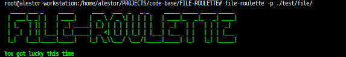

<h1 align=center>FILE-ROULETTE</h1>

> This is a simple code for russian roulette where a random file or directory gets deleted if you got unlucky(please play with caution)

<p align=center>

<a href="https://github.com/alestor123/FILE-ROULETTE/issues">
</a>

<a href="https://www.npmjs.com/package/file-roulette"></a>
</p>
<p align=center>
<a href="https://npmjs.org/package/file-roulette">
</a>
</p>

## 🚀 Usage

## API

```
const fileRoulette = require('./App')
fileRoulette('./test/file/lol.js')
```

## Quick use
```
$ npx file-roulette -p <path>
```
## CLI Installation
```
$ npm install -g file-roulette
```
```
$ file-roulette -p <path>
```

`` -p <path> `` is optional

# Screenshots    




## 💖 [Donate](https://alestor123.is-a.dev/donate)


## Author

👤 **Alestor Aldous**

- Twitter: [@alestor123](https://twitter.com/alestor123)
- Github: [@alestor123](https://github.com/alestor123)


## 📝 License
> MIT

Copyright © 2022 [Alestor Aldous](https://github.com/alestor123).<br />